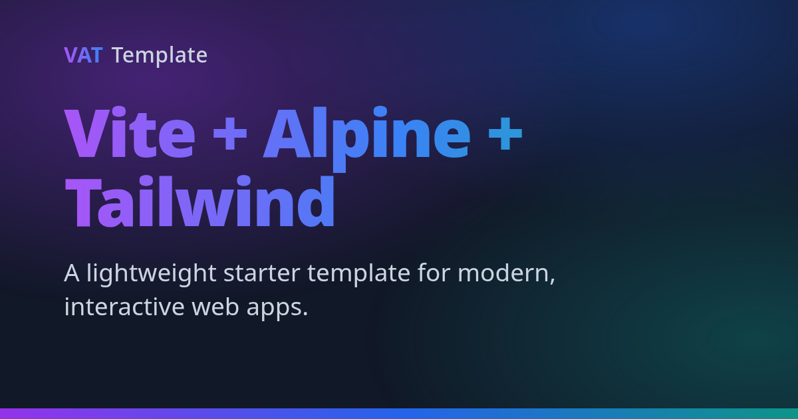

<p align="center">
  
</p>

# ⚡ Vite + 🗻 Alpine + 🎨 Tailwind — Template


🔗 **[Live demo](https://vzsoares.github.io/vite-alpine-tailwind/)**

A **lightweight client-side SPA** starter: it authors its UI as **plain HTML
pages** 🧩, wires reactivity with **Alpine.js** 🗻, styles with **Tailwind CSS
v4** 🎨, and routes entirely in the browser with **pinecone-router** 🧭 (which
loads each page's HTML into the shell) — shipping a tiny bundle and deploying free
to **GitHub Pages**. 🚀

> Looking for the batteries-included, **prerendered** sibling (type-safe JSX →
> static HTML, Markdown blog, full-text search, SEO/social cards)? That's
> **[vite-alpine-tailwind-x](https://github.com/vzsoares/vite-alpine-tailwind-x)**.
> This repo is the lean, pure client-side counterpart.

## ✨ Features

**Stack**

- ⚡️ **Vite** — lightning-fast dev server and builds (Rolldown / oxc)
- 🗻 **Alpine.js** — the reactivity behind every component
- 🧩 **Plain HTML pages** — each route is an HTML file the router loads (Light DOM)
- 🧭 **pinecone-router** — client-side routing (history mode) for Alpine
- 🎨 **Tailwind CSS v4** — utility-first styling (+ `typography` prose + **daisyUI**)
- 📦 **TypeScript** · 🍞 **Bun** · 🧹 **Biome** · 🧪 **Vitest** · 🎭 **Playwright**

**What you get**

- 🧩 **Plain-HTML pages** — inline nav/footer chrome in the shell + one
  `src/pages/*.html` file per route, loaded by the router
- 🧭 **SPA routing** — `/`, `/about`, `/blog`, `/blog/:slug`, and a `notfound` route
- 📝 **Static blog** — posts as data, rendered client-side (index + per-post pages)
- 🌙 **Dark mode** — `data-theme` + `.dark`, remembers your choice
- ♿ **Accessible** — landmarks, visible focus rings, `aria-*`
- 🛰️ **GitHub Pages ready** — base path wired + `404.html` SPA deep-link fallback
- 🛡️ **Hardened CI** — lint/type/unit + e2e (dev **and** production build),
  Dependabot, CodeQL & gitleaks, auto-deploy to GitHub Pages

## 🏁 Quick Start

```bash
# Use this template, then:
bun install
bun run dev        # 👉 http://localhost:5173

bun run build      # build SPA into dist/ (+ 404.html fallback)
bun run preview    # preview the production build
```

> First time running e2e tests? Install the browser once:
> `bunx playwright install chromium`

## 🛠️ Post-install checklist

After clicking **"Use this template"** and cloning your new repo, run through these
once before your first commit:

**Identity**

- [ ] **Version** — reset `"version"` in `package.json` to `"0.1.0"`
- [ ] **Author** — update `"author"` in `package.json` to your name
- [ ] **Project name & description** — update `"name"` and `"description"` in
  `package.json`; update `<title>`, the three OG/Twitter title tags, and the two
  description meta tags in `index.html`
- [ ] **Nav brand** — replace `VAT` / `Template` in the `<nav>` in `index.html`

**Base path & URLs (critical for GitHub Pages)**

- [ ] **`src/config.ts`** — set `BASE`, `SITE_URL`, `REPO_URL`, and `AUTHOR` —
  all OG/Twitter meta tags, nav/footer links, and Playwright's preview suite
  derive from these automatically
- [ ] **Social image** — replace `public/og.png` with your own 1200 × 630 image

**Repository URLs**

- [ ] **`package.json`** — update `"homepage"`, `"repository.url"`, and `"bugs.url"`
  to point to your new repo

**GitHub Pages**

- [ ] **Enable Pages** — go to **Settings → Pages → Source** and select
  **"GitHub Actions"** (the deploy workflow is already wired up)

**Documentation**

- [ ] **Rewrite this README** — replace the template docs with your project's own
  description, features, and instructions

## 📜 Scripts

| Command                    | Description                                   |
| -------------------------- | --------------------------------------------- |
| `bun run dev`              | Start the Vite dev server with HMR            |
| `bun run build`            | Build into `dist/` (emits a `404.html` copy)  |
| `bun run preview`          | Preview the production build locally          |
| `bun run check`            | Lint **and** format the codebase (Biome)      |
| `bun run lint`             | Lint without writing changes (Biome)          |
| `bun run format`           | Format files in place (Biome)                 |
| `bun run typecheck`        | Type-check with `tsc --noEmit`                |
| `bun run test`             | Run unit tests once (Vitest)                  |
| `bun run test:watch`       | Run unit tests in watch mode (Vitest)         |
| `bun run test:e2e`         | E2E browser tests — dev **and** production-build suites (Playwright) |

## 🗂️ Project Structure

```
/
├── public/         # Static assets copied as-is (favicon.ico, og.png, logos/)
├── index.html      # SPA shell: <body> dark-mode state, inline nav/footer, #app, route table
├── src/
│   ├── app.ts      # Bootstrap: Alpine.plugin → data → store → settings → start
│   ├── alpine.ts   # Typed Alpine.data() factories: counter(), blogPost()
│   ├── config.ts   # Deploy config: BASE (path) and SITE_URL (canonical URL)
│   ├── globals.d.ts# Ambient types (__APP_VERSION__, window.Alpine/PineconeRouter)
│   ├── styles.css  # Tailwind + typography + daisyUI + brand tokens + dark + x-cloak
│   ├── content/posts.ts # Blog content (HTML strings) + getPost()
│   └── pages/      # One plain HTML file per route, loaded by the router
│       └── home.html · about.html · blog.html · post.html · not-found.html
├── e2e/            # Playwright e2e (vs. dev): routing, counter, dark-mode, blog…
├── e2e-preview/    # E2E vs. the production build (base path, 404.html fallback)
├── vite.config.ts  # base, Tailwind, page-templates plugin, SPA 404 plugin, Vitest
└── docs/pages-and-routing.md  # The plain-HTML page + Alpine + router pattern & gotchas
```

## 🧩 Pages

Each route's UI is a **plain HTML file** in `src/pages/` — Alpine directives, no
build step, no framework runtime beyond Alpine. pinecone-router loads the file
into `<main id="app">`; Alpine's MutationObserver then initializes its directives.
Light DOM throughout, so the global Tailwind/daisyUI stylesheet applies.

```html
<!-- src/pages/home.html (excerpt) -->
<div x-data="counter(0)">
    <p x-text="count"></p>
    <button @click="increment()">+</button>
</div>
```

Reactive logic lives in typed `Alpine.data()` factories (`src/alpine.ts`) so it
stays unit-testable; pages reference them by `x-data`. Data the HTML needs at
runtime (it can't import TS) is exposed on `Alpine.store("app", …)` — `version`,
`base`, `posts` — read via `$store.app`. See
[docs/pages-and-routing.md](docs/pages-and-routing.md) for the full pattern + gotchas.

## 🧭 Routing

Routing is **client-side**, declared in `index.html` as a table of
[pinecone-router](https://pinecone-router.github.io/router/) `<template x-route>`
rows. Each loads a page's HTML file into `<main id="app">`:

```html
<template x-route="/about" x-template.target.app="/pages/about.html"></template>
<template x-route="/blog/:slug" x-template.target.app="/pages/post.html"></template>
```

The files live in `src/pages/*.html`; a small Vite plugin (`page-templates` in
`vite.config.ts`) serves them at `/pages/*.html` in dev and copies them to
`dist/pages/` on build.

- **Add a route** with two edits: create `src/pages/<name>.html`, and add a
  `<template x-route="/<name>" x-template.target.app="/pages/<name>.html">` row.
- Navigation is plain `<a href="/about">` — pinecone intercepts clicks and
  prepends the configured `basePath`. Add `native` to opt a link out (externals).
- **Dynamic params** (`/blog/:slug`) are read via the `$params` magic. Because
  pinecone does not re-render the template when only the param changes (e.g.
  prev/next post), `post.html` uses `x-effect="load($params.slug)"` to re-resolve.

## 🌙 Dark mode & 🎨 UI (daisyUI)

Dark mode is Alpine state on `<body>` (persisted to `localStorage`), toggled by
the nav's theme button; daisyUI themes follow via `data-theme`. Rebrand the whole
site by editing the three `brand-*` tokens in `src/styles.css`. See [DESIGN.md](DESIGN.md).

## 🚀 Deploy

Pushing to `main` runs the checks and deploys `dist/` to **GitHub Pages** via
`.github/workflows/deploy.yml`. Because routing is client-side, the build emits a
`404.html` (a copy of `index.html`) so deep links / refreshes resolve — GitHub
Pages serves it for unknown paths and the router takes over. Deploying elsewhere?
Update `BASE` in `src/config.ts` (it sets Vite's `base` and the router `basePath`).

## 📚 Docs

- 🧩 **[docs/pages-and-routing.md](docs/pages-and-routing.md)** — the page + router pattern
- 🎨 **[DESIGN.md](DESIGN.md)** — design tokens & visual system
- 🤖 **[AGENTS.md](AGENTS.md)** — guide for AI coding agents (verify, tools, gotchas)

## 📄 License

[MIT License](LICENSE)

---

Created by [vzsoares](https://github.com/vzsoares) 💜
